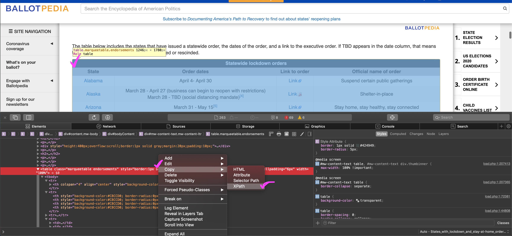

```{r setup, include=FALSE}
knitr::opts_chunk$set(echo = FALSE)
```

__The problem: add date annotations to a bar graph of COVID-19 deaths, but those dates are in an online table, and we have to join those dates onto another data set.__

We will use the rvest package to scrape a table from the web, then the `stringr` and `data.table` packages to clean it up and prep it for use in `ggplot2`.

 * The dates table will come from [Ballotpedia](https://ballotpedia.org/States_with_lockdown_and_stay-at-home_orders_in_response_to_the_coronavirus_(COVID-19)_pandemic,_2020)

 * The COVID-19 deaths data will come from [The New York Times](https://github.com/nytimes/covid-19-data)

```{r function, echo=TRUE, message=FALSE, warning=FALSE, paged.print=FALSE}

library(rvest)
library(stringr)
library(ggplot2)
library(data.table)

# define a function that can scrape a table from the web
get_html_table <- function(url, xpath, header = NA) {
  
  url %>%
    read_html() %>% # download page source
    html_nodes(xpath = xpath) %>%
    html_table(header = header) %>% # extract html table
    .[[1]] %>% # get dataframe from list
    as.data.table()

}

```

```{r get_table, echo=TRUE, message=FALSE, warning=FALSE, paged.print=FALSE}

# set variables for url and xpath
# spliting the url here only for printing-width purposes on the blog
half1 <- "https://ballotpedia.org/States_with_lockdown_and_stay-at-home_orders"
half2 <- "_in_response_to_the_coronavirus_(COVID-19)_pandemic,_2020"
my_url <- paste0(half1, half2)

my_xpath <- '//*[@id="mw-content-text"]/table[1]'

# get the table
stay_at_home_table <- get_html_table(
  url = my_url,
  xpath = my_xpath,
  header = FALSE
)

```

<br>

To get the XPath for the table, go to the site, right-click anywhere on the table and select Inspect Element. You should then see the table in the html. Right-click the table in the html and select Copy, then XPath. I'm on a Mac in Safari, so this may look a little different if you are on Linux or Windows or other browsers.

```{r image, echo=FALSE, message=FALSE, warning=FALSE, layout="l-page", paged.print=FALSE}

```

<br>

Row 2 actually has the column names we want.

```{r table_head, echo=TRUE, message=FALSE, warning=FALSE, paged.print=FALSE}

# extract row 2 values as a vector for use as column names
col_names <- stay_at_home_table[2, paste(.SD)] %>%
  str_to_lower() %>%
  str_replace_all(" ", "_")

# keep rows 3 through the end, set new column names, drop link column
stay_at_home_table <- stay_at_home_table[3:.N]
setnames(stay_at_home_table, col_names)
stay_at_home_table[, link_to_order := NULL]

stay_at_home_table[1]

```

<br>

We need two date columns, one for the start dates and another column for the end dates. Unfortunately, the table authors combine this data in a single column. We will split the existing date column into two using `tstrsplit()` from the `data.table` package. First, we will remove the citations from the dates, then split the date column into two. We finish up by handling the various types of missing data we find.

```{r clean, echo=TRUE, message=FALSE, warning=FALSE, paged.print=FALSE}

# clean clean clean
stay_at_home_table[ # remove citations
  , order_dates := str_remove_all(order_dates, "\\[..?\\]")
][ # fix Alaska dates
  state == "Alaska", order_dates := "March 28 - TBD"
][ # split date column into two columns
  , c("start", "end") := tstrsplit(order_dates, "-", fixed = TRUE)
][ # trim white space from both columns
  , c("start", "end") := lapply(.SD, str_trim), .SDcols = c("start", "end")
][ # drop the original date column
  , order_dates := NULL
][ # replace none and tbd with NA
  , c("start", "end") := lapply(.SD, function(x) fifelse(x %in% c("None", "TBD"), NA_character_, x))
  , .SDcols = c("start", "end")
][ # in other column replace NA string with word None
  official_name_of_order == "N/A", official_name_of_order := "None"
][ # add year to dates so we can convert them
  , c("start", "end") := lapply(.SD, function(x) fifelse(!is.na(x), paste(x, "2020"), x)),
  , .SDcols = c("start", "end")
][# then convert all to proper date class
  , c("start", "end") := lapply(.SD, anytime::anydate), .SDcols = c("start", "end")
]

stay_at_home_table[1]

```

<br>

Get the COVID-19 data using the fast `fread()` function from `data.table`, and also sum up the total cases and deaths and get the date range of the data.

```{r states, echo=TRUE, message=FALSE, warning=FALSE, paged.print=FALSE}

# get state data from The New York Times github
states <- fread(
  input = "https://raw.githubusercontent.com/nytimes/covid-19-data/master/us-states.csv",
  colClasses = c(date = 'IDate'),
  key = c('state', 'date')
)

# get national data from The New York Times github
us <- fread(
  input = "https://raw.githubusercontent.com/nytimes/covid-19-data/master/us.csv",
  colClasses = c(date = 'IDate'),
  key = 'date'
)

# total cases in the US
us_cases <- us[, last(cases)] %>% 
  formatC(digits = 0, format = "d", big.mark = ",")

# total deaths in the US
us_deaths <- us[, last(deaths)] %>% 
  formatC(digits = 0, format = "d", big.mark = ",")

# date range of the data
date_range <- states[, range(unique(date))]
names(date_range) <- c("first", "last")

```

<br>

Build our data for the plot. We'll make 7-day rolling averages for cases and deaths. The rolling averages will smooth over reporting inconsistencies, for example, when a hospital or county may report all weekend deaths on a Monday. Then we will join the state's closing and reopening dates onto our COVID counts for each state.

```{r plot_dat, echo=TRUE, message=FALSE, warning=FALSE, paged.print=FALSE}

plot_dat <- states[
  , `:=`( # get new cases and deaths per day by subtracting previous day (lag)
      new_cases =  cases - shift(cases,  type = "lag", n = 1L),
      new_deaths = deaths -shift(deaths, type = "lag", n = 1L)
    )
    , by = state
  ][ # rolling avergaes for new cases and new deaths by state
    , `:=`(
      nc_avg = frollmean(new_cases,  7L, align = "right"),
      nd_avg = frollmean(new_deaths, 7L, align = "right")
    )
    , by = state
  ][ # round them all up using ceiling
    , c("nc_avg", "nd_avg") := lapply(.SD, ceiling), .SDcols = c("nc_avg", "nd_avg")
  ][ # join the closing and reopening dates
    stay_at_home_table, on = "state"
  ][
    , plot_label_end := "REOPEN"
  ][
    , plot_label_start := "CLOSE"
  ]

```

<br>

Plotting all the data for each state would be too much for this blog post. Instead, I'll pick two states and plot their daily death counts, 7-day rolling averages, and closing and opening dates.

```{r plot, echo=TRUE, fig.height=6, fig.width=10, message=FALSE, warning=FALSE, layout='l-screen', paged.print=FALSE, preview=TRUE}

# colors
main_blue <- "#abbfd3"
accent_light <- "#eef2f6"
accent_dark <- "#698cb0"
grey_dark <- "#627384"
restriction_red <- "#f47171"
reopen_green <- "#24a8a8"

# max date for x axis
max_plot_date <- max(
  Sys.Date(),
  plot_dat[state %chin% c("Texas", "Michigan"),
           max(end, na.rm = TRUE)]
)

plot_dat[state %chin% c("Texas", "Michigan"), ] %>% 
      ggplot(aes(x = date, y = new_deaths)) + 
      geom_bar(stat = "identity",
               fill = main_blue,
               color = accent_light,
               width = 1,
               alpha = .4) +
      geom_smooth(aes(x = date, y = nd_avg),
                  method = "loess",
                  color = accent_dark,
                  se = FALSE,
                  size = .5) +
      geom_text(aes(x = as.Date("2020-03-11"), y = 0.01,
                    label = "PANDEMIC 3/11"),
                size = 2, angle = 90, vjust = 0, hjust = 0, color = grey_dark) +
      geom_text(aes(x = start, y = 0.01, label = plot_label_start),
                size = 2, angle = 90, vjust = 0, hjust = 0, color = restriction_red) +
      geom_text(aes(x = end, y = 0.01, label = plot_label_end),
               size = 2, angle = 90, vjust = 0, hjust = 0, color = reopen_green) +
      scale_x_date(limits = c(as.Date("2020-03-10"), max_plot_date), breaks = "1 week") +
      facet_wrap(~state, scales = "free",
                 ncol = 1) +
      labs(y = "",
           x = "",
           title = "New Deaths by Day Since March 11th 2020",
           subtitle = "on March 11th, 2020 the WHO declared the coronavirus outbreak a global pandemic",
           caption = "Dataviz by Jeremy Allen | COVID data by The New York Time | Open Close Dates by Ballotpedia") +
      theme(
        axis.ticks = element_line(color = accent_dark, size = .3),
        axis.line.x = element_line(color = accent_dark, size = .3),
        axis.text = element_text(color = "#627384", size = 8),
        axis.text.x = element_text(angle = 90, vjust = .5),
        axis.title = element_text(color = "#627384", size = 8),
        panel.background = element_rect(fill = accent_light, color = accent_light),
        plot.background = element_rect(fill = accent_light, color = accent_light),
        panel.grid = element_blank(),
        strip.background = element_rect(fill = accent_light, color = accent_light),
        strip.text = element_text(color = "#627384", size = 12, hjust = 0,
                                  margin = unit(c(10,10,10,10), "pt")),
        plot.title = element_text(color = "#627384", size = 20,
                                  margin = unit(c(2,10,5,0), "pt")),
        plot.subtitle = element_text(color = "#627384", size = 14,
                                     margin = unit(c(5,10,20,0), "pt")),
        plot.caption = element_text(color = "#627384", size = 6),
        plot.margin = unit(c(15,40,15,40), "pt"),
        panel.spacing = unit(70, "pt")
      )

```

