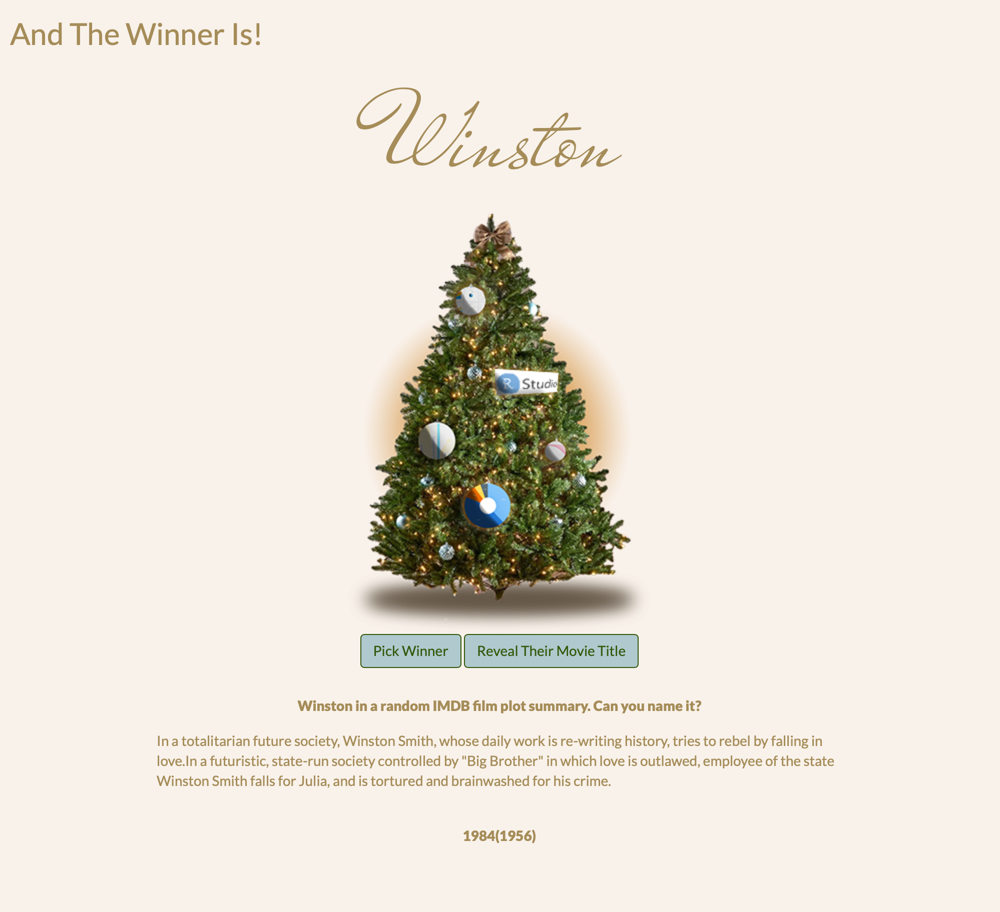

```{r setup, include=FALSE}
knitr::opts_chunk$set(echo = FALSE)
```

For an annual holiday Zoom party I was asked to draw a random team member's name who would win a prize. So I made a Shiny app! The code is on my [Github](https://github.com/jeremy-allen/name-draw) if you want it. The app is on [shinyapps.io.](https://jeremyallen.shinyapps.io/name_draw/) if you want to play.

## The Fun Part

In addition to picking a name, the app also searches IMDB movie plot summaries for that name, picks a random one from the results and shows it in the app without the movie title. Then everyone tries to guess the movie title. There is a "reveal" button to reveal the movie title if no one can guess. 

I removed my coworkers' names from the app and am using a random selection from the [RStudio team page](https://rstudio.com/about/). Here's a preview, now go play!




