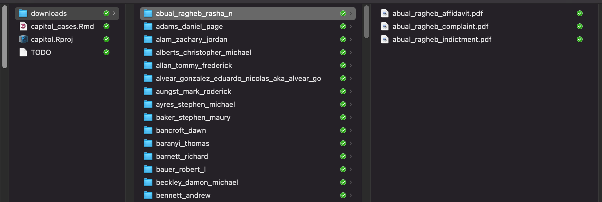

```{r setup, include=FALSE}
knitr::opts_chunk$set(echo = TRUE)
```

### Problem: How do I get all the complaints, affidavits, and indictments (all at once!) for everyone charged so far in the attack on the U.S. Capitol?

### Solution: R's tidyverse is a good way. The rvest package has easy functions for scraping the web.

In this article I will use only [tidyverse](https://www.tidyverse.org) packages. I'll show you exploratory data analysis, how to loop through an HTML table with the [rvest](https://rvest.tidyverse.org) and [purrr](https://purrr.tidyverse.org) packages, automatically create unique folders on your system for each set of documents, and use [the amazing polite package](https://dmi3kno.github.io/polite/) to handle identifying ourselves to the web host and limiting our activity on their server so that we do not cause harm.

```{r packages, echo=TRUE, message=FALSE, warning=FALSE, paged.print=FALSE}

library(assertthat)
library(here)
library(tidyverse)
library(rvest)
library(polite)
library(fs)

```

All of the documents we want are [on this page](https://www.justice.gov/usao-dc/capitol-breach-cases) of the United States District Attorney's Office for the District of Columbia. The page is mostly a big HTML table with a row for each defendant. A documents column contains all the documents for each person.

Using functions from the polite package, we start by creating a session then scraping the HTML from the webpage. This does not give us the PDF documents, though.

```{r page, echo=TRUE, message=FALSE, warning=FALSE, paged.print=FALSE}

cases_url <- "https://www.justice.gov/usao-dc/capitol-breach-cases"

# from the polite package, we properly identify ourselves and respect any explicit limits
session <- bow(cases_url, force = TRUE)

# scrape the page contents
cases_page <- scrape(session)

```

Now that we have the HTML content we do a little exploratory data analysis to see how everything is organized and decide how we want to download all the defendant documents.

How many cases do we have?

```{r echo=TRUE, message=FALSE, warning=FALSE, paged.print=FALSE}

# extract the HTML table from the page content
cases_table <- cases_page %>% 
 html_node("table") %>% 
 html_table()

# How many cases do we have?
cases_table %>%
  pull(`Case Number`) %>%
  n_distinct()

```

How many defendants do we have?  

```{r echo=TRUE, message=FALSE, warning=FALSE, paged.print=FALSE}

# How many defendants do we have?
cases_table %>%
  pull(`Name`) %>%
  n_distinct()

```

If any defendant names are duplicated, let's see them.

```{r echo=TRUE, message=FALSE, warning=FALSE, paged.print=FALSE}

# if any defendant names are duplicated, let's see them
if (cases_table %>%
    pull(Name) %>%
    duplicated() %>%
    any()) {
  
  cases_table %>%
    count(Name, sort = TRUE) %>% 
    filter(n > 1) %>% 
    arrange(desc(n))
  
}

```

If any case numbers are duplicated, let's see them.

```{r echo=TRUE, message=FALSE, warning=FALSE, paged.print=FALSE}

# if any case numbers are duplicated, let's see them
if (cases_table %>%
    pull(`Case Number`) %>%
    duplicated() %>%
    any()) {
  
  cases_table %>% 
    group_by(`Case Number`) %>% 
    mutate(n = n()) %>% 
    ungroup() %>% 
    select(n, `Case Number`, everything()) %>% 
    arrange(desc(n), `Case Number`, Name) 
  
  # now we can see who all is in each case when there are more than one
  
}

```

How many documents do we have?  

```{r echo=TRUE, message=FALSE, warning=FALSE, paged.print=FALSE}

# How many documents do we have?
cases_table %>%
  pull(`Associated Documents`) %>%
  n_distinct()

```

We want to know if there is a one-to-one or one-to-many relationship between any cases and documents. When we look at the documents column we can see that some people have the same associated documents. BROWN, Terry; CURZIO, Michael; FITCHETT, Cindy; GALLAGHER, Thomas; SWEET, Douglas all share the same "Fitchett et al - Complaint Fitchett et al - Statement of Facts Fitchett -Indictment" document. We must decide if we want to download that document just once or once for each person it's associated with.

When I last ran this code there were 169 unique document names in the column, but we really need to see how many unique document download links there are.

```{r links, echo=TRUE, message=FALSE, warning=FALSE, paged.print=FALSE}

defendant_names <- cases_page %>%
  html_nodes("td") %>%
  html_nodes("a") %>%
  html_attr('href') %>%
  str_remove("/usao-dc/defendants/")
  
# make a table of just download info
download_links <- tibble(
  link_names = cases_page %>% # making the link_names column 
    html_nodes("td") %>% # links from html table, not from elsewhere in page
    html_nodes("a") %>%
    html_text(),
  link_urls = cases_page %>% # making the link_urls column
    html_nodes("td") %>% 
    html_nodes("a") %>%
    html_attr('href') %>% 
    str_c("https://www.justice.gov", .) # paste on the missing domain
) %>% # table is complete, now keep only rows with download links
  filter(str_detect(link_urls, "download$")) %>% 
  unique() # no duplicates

# How many unique document download links?
download_links %>% pull(link_urls) %>% n_distinct()

```

Hmm, so the HTML table had 169 document names but 322 unique download links. I'm guessing that a single document about multiple defendants gets a unique download link each time it's listed for a unique defendant. Now I don't think it will be easy to avoid downloading duplicate documents.

We want to keep everything organized by defendant, so we are going to loop through each row of the table and capture the download links per defendant, then while downloading we will save documents to a folder unique to each defendant even if that means the same document ends up in multiple folders.

Let's get the contents of each row into a list but drop the header row. Here we use `html_nodes("tr")` from the rvest package to target table rows, which outputs an xml nodeset, but we want a regular R list, so we use `map()` from the purrr package to extract the table cells into a list.

```{r list, echo=TRUE, message=FALSE, warning=FALSE, paged.print=FALSE}

# Let's get the contents of each row into a list but drop the header row.
rows <- cases_page %>%
  html_nodes("tr") %>% 
  map(~html_nodes(., "td")) %>% # gets cell content per row
  compact() # drops empty header row

```

Now we can iterate through each element of this list (a row from the HTML table) and do whatever we want. Let's create a function to do what we want, then map that function over each list element.

The main jobs of this function are

* get the defendant's name

* get list of download urls for their documents

* create a filename no longer than 45 characters for each document

* download docs into a folder named after defendant, also no longer than 45 characters


```{r function, echo=TRUE, message=FALSE, warning=FALSE, paged.print=FALSE}

# function that downloads all the docs
download_defendant_docs <- function(row) {
  
  # get the defendant's name
  # get list of download urls for their documents
  # create a filename no longer than 45 characters for each document
  # download docs into folder named after defendant
  
  message("**************************************************")
  
  # who is the defendant in this row?
  defendant <- row %>%
    html_children() %>% 
    html_text() %>% 
    first()
  
  # clean the name so we can use it as a folder name
  # and just in case any rows are missing a name, we will give them 'no_name'
  if (nchar(defendant) > 0) {
    defendant <- defendant %>%
      str_replace_all("&", "and") %>% 
      str_replace_all("[^a-zA-Z0-9]", "_") %>% # replace all non alpha-numeric
      str_replace_all("_{2,3}", "_") %>% # replace extra underscores with single underscore
      str_remove("[^a-zA-Z0-9]$") %>% # remove any non-alpha-numeric at the end
      str_to_lower()
  } else {
    defendant <- "no_name"
  }
  
  # limit defendant names to 45 characters
  if (nchar(defendant) > 45) {
      defendant <- str_extract(defendant, "^.{45}")
    }
  
  assert_that(
    inherits(defendant, "character"),
    length(defendant) > 0
  )
  
  # there can be more than one document for a defendant so let's get the docs into a list
  urls_to_download <- row %>%
    html_children() %>% 
    html_nodes("a") %>% 
    html_attr("href") %>% 
    map(~str_c("https://www.justice.gov", .)) # add missing domain on all links
  
  assert_that(
    inherits(urls_to_download, "list"),
    length(urls_to_download) > 0,
    # make sure there are no NAs
    map(urls_to_download, is.na) %>% unlist() %>% sum() == 0
  )
  
  doc_names <- row %>%
    html_children() %>% 
    html_nodes("li") %>% # doc links are in html list tags
    html_text() %>% 
    as.list() %>% 
    map(~str_remove(., ".pdf")) %>% # a few filenames have .pdf inside the filename
    map(~str_replace_all(., "&", "and")) %>% 
    map(~str_replace_all(., "[^a-zA-Z0-9]", "_")) %>% # replace all non alpha-numeric
    map(~str_replace_all(., "_{2,3}", "_")) %>% # replace extra underscores with single underscore
    map(~str_to_lower(.)) %>% 
    # limit filenames to 45 characters
    modify_if(.p = ~nchar(.x) > 45, .f = ~str_extract(.x, "^.{45}")) %>% 
    map(~str_c(., ".pdf")) # append .pdf to all filenames
  
  assert_that(
    inherits(doc_names, "list"),
    length(doc_names) > 0,
    map(doc_names, is.na) %>% unlist() %>% sum() == 0
  )
  
  # make sure we have the same number of urls and document names
  assert_that(
    length(urls_to_download) == length(doc_names)
  )
  
  # a friendly message that will appear in the console each time this function runs
  message(str_c("... have defendant, doc names, and links, proceeding to download for: ", defendant, "\n"))
  
  # Confirm or create a download folder and defendant folder. The dir functions
  # are from the fs package. The here() function is from the here package, and it helps
  # us make file paths.
  if (!dir_exists(here("downloads"))) {
    dir_create(here("downloads"))
  }
  
  if (!dir_exists(here("downloads", defendant))) {
    dir_create(here("downloads", defendant))
  }
  
  #---- politely download the files (will wait 5 seconds between each) ----

  # function that will take a url and filename and do the downloads politley
  get_doc <- function(url , filename) {
    nod(session, url) %>% # nod and rip are from the polite package
      rip(destfile = filename,
          path = here("downloads", defendant),
          overwrite = TRUE)
  }
  
  # Map our function over the two lists, but first put them in a single list
  # that gets passed to pmap()
  list(url = urls_to_download, filename = doc_names) %>% 
    pmap(safely(get_doc)) # wrapped in safely so it won't stop on error

  message(str_c("...finished downloads for: ", defendant, "\n\n\n"))
  
} # end function

```

Just before running our main function I like to print a few messages to console

```{r messages, echo=TRUE, message=FALSE, warning=FALSE, paged.print=FALSE}

message(str_c("There are ", length(rows), " rows from wich to download documents", "\n"))
message(str_c("There are ", nrow(download_links), " documents to download", "\n"))
message(str_c("There will be a 5-second pause between each document", "\n"))
message(str_c("See https://dmi3kno.github.io/polite/reference/set_delay.html for more details", "\n\n"))

```

The last thing to do is map the function over our list of rows with:  
  
map(rows, download_defendant_docs)  

Wow that seems like a lot of work to get to those documents! Initially it was. But stepping through all of the exploratory data analysis is important to know what to expect and how to write our functions to handle different possibilities.

If you run this, you will be downloading over 300 PDF files with a 5-second pause between each one. So refill that coffee!

If you want the code all in one piece you [get it from my Github here](https://github.com/jeremy-allen/capitol-attack).


