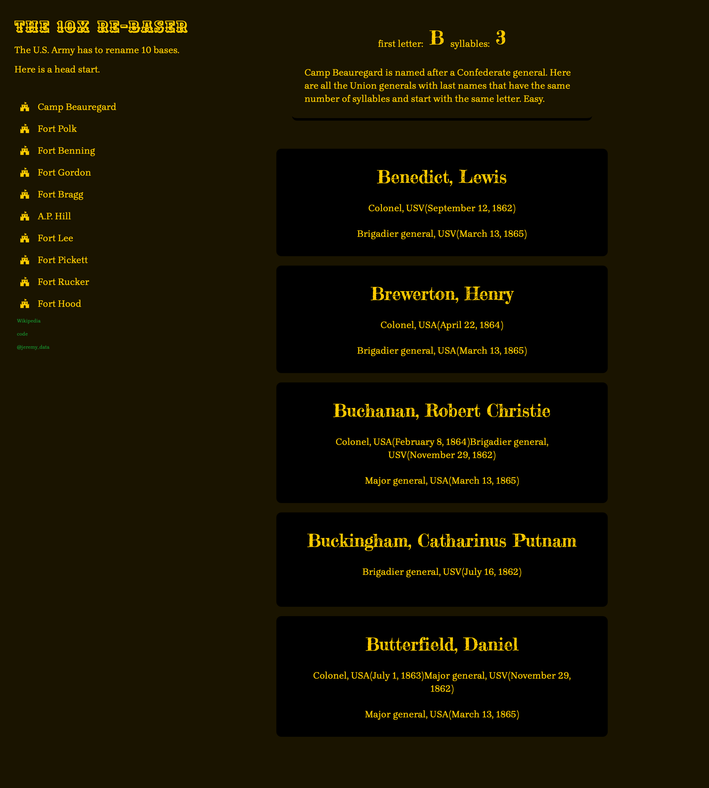

```{r setup, include=FALSE}
knitr::opts_chunk$set(echo = FALSE)
```



The Biden administration has given the Army three years to rename Confederate-named bases. I built this little web app that scrapes all Union general names from Wikipedia, then identifies the first letter of their last name and how many syllables are in that name. Click on a Confederate-named base and see all Union generals who match the first letter and number of syllables. I even found some Google fonts that are similar to 19-century fonts.

I use the [rvest](https://rvest.tidyverse.org) package to scrape the tables from Wikipedia. I count syllables with the nsyllable() function from the [quanteda](https://quanteda.io) package. With [purrr](https://purrr.tidyverse.org)'s pmap() function I iterate over each Union general to make a Shiny UI element that formats each general's name and ranks into a card format. All layout for the Shiny app is done with [CSS Flexbox](https://css-tricks.com/snippets/css/a-guide-to-flexbox/).

[See the web app here](https://jeremyallen.shinyapps.io/base-names/).

All the code is on [my GitHub](https://github.com/jeremy-allen/base-names).


