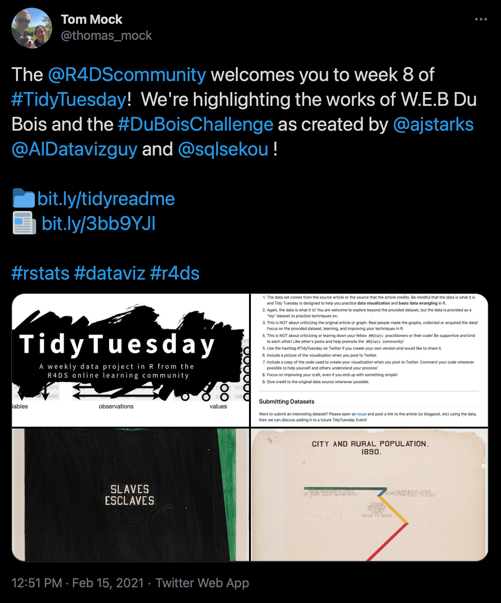
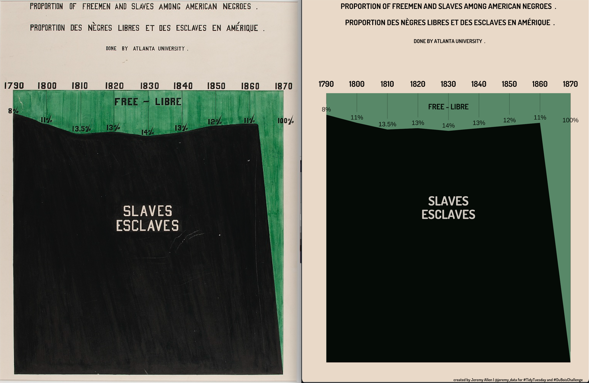

```{r setup, include=FALSE}
knitr::opts_chunk$set(echo = FALSE)
```

For the 1900 Paris Exposition, sociologists W.E.B Du Bois curated a set of photographs and created hand-drawn data visualizations to combat racism in science and culture. In February 2021 #TidyTuesday and the #DuBoisChallenge collaborated to challenge us to use modern tools to recreate Du Bois's data visualizations.




I chose to recreate plate 51. I learned a ton about spacing in R's ggplot2 package. How to implement margins around any element, how to add empty lines in title and subtitles, how to use `if` statements to conditionally place data labels and more. [All the code](https://github.com/jeremy-allen/webdubois) is on my Github.



Please visit two places to read and see more about W.E.B Du Bois's work for the 1900 Paris Exposition. [The Library of Congress site](https://www.loc.gov/pictures/collection/anedub/dubois.html) for all of the materials. [Anthony Starks's recreations](https://medium.com/nightingale/recreating-w-e-b-du-boiss-data-portraits-87dd36096f34) of all the pieces.
