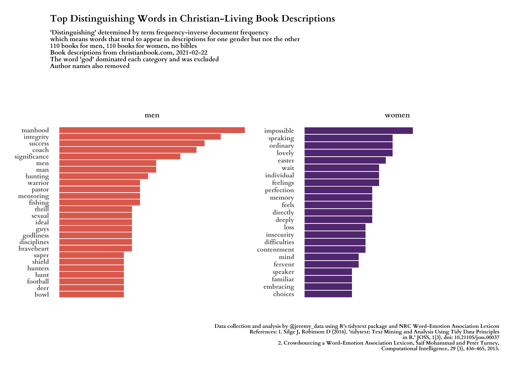
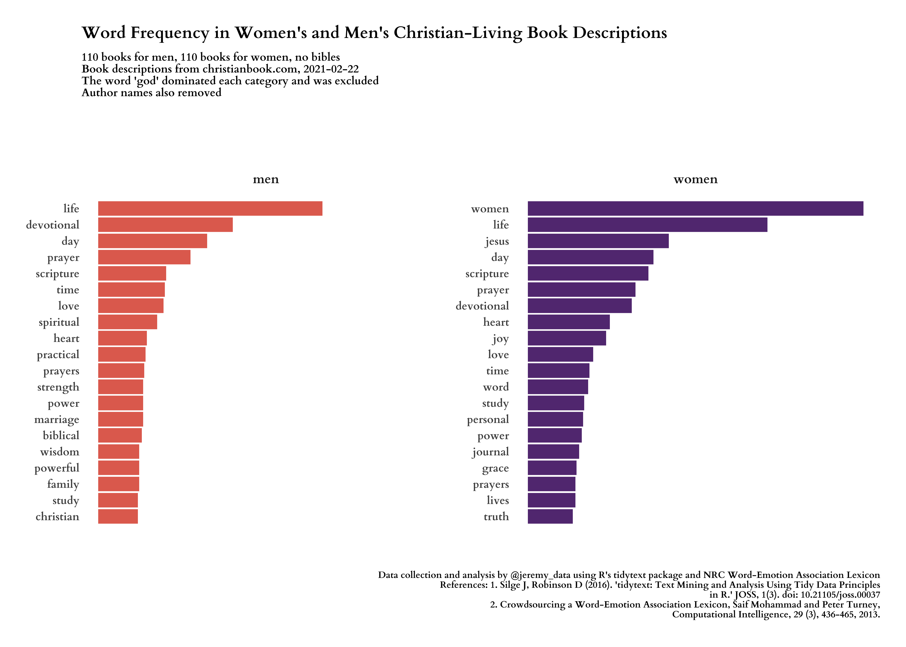
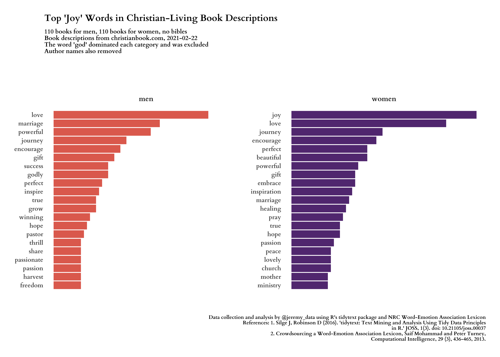
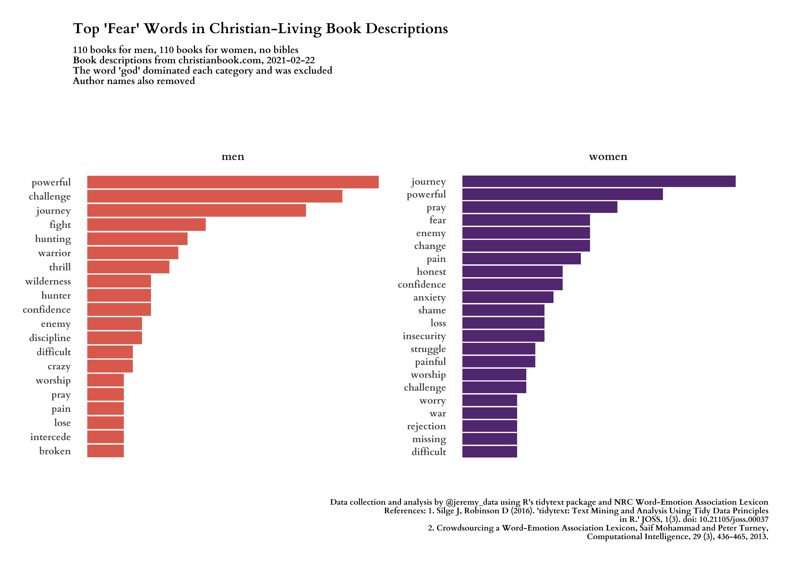
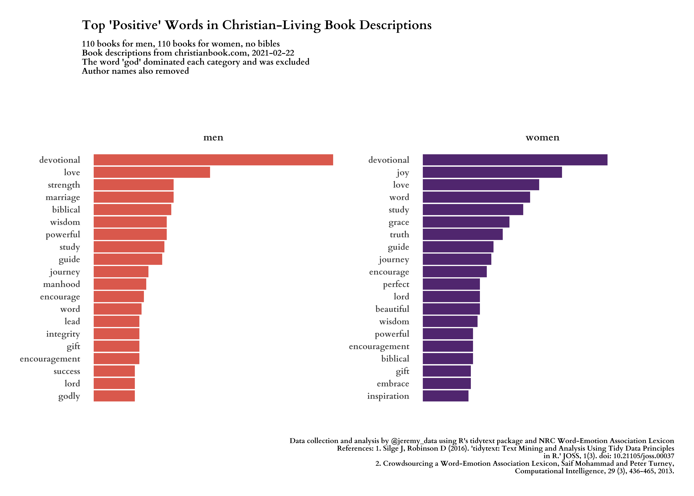
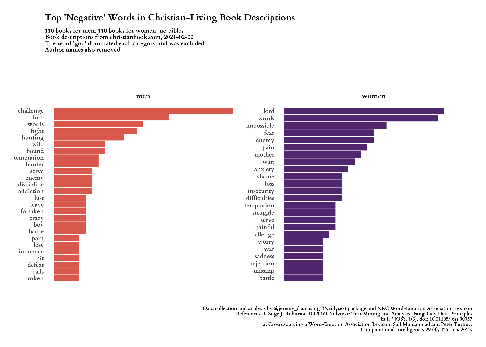

```{r image, echo=FALSE, fig.cap="Top distinguishing words in men's and women's Christian-Living book descriptions", message=FALSE, warning=FALSE, layout="l-screen-inset", paged.print=FALSE}



```

## The Question: How does word usage vary in Christian book descriptions marketed distinctly for men and women?

In this article I primarily use the [tidytext](https://juliasilge.github.io/tidytext/) and [tidyverse](https://www.tidyverse.org) packages to analyze Christian book descriptions. The [NRC Word-Emotion Association Lexicon](https://saifmohammad.com/WebPages/NRC-Emotion-Lexicon.htm) allows us to analyze various kinds of emotional words. [The amazing polite package](https://dmi3kno.github.io/polite/) ensures we are courteous when we scrape the descriptions from the website. [The rvest package](https://rvest.tidyverse.org) processes all of the HTML for us. I also use the [showtext package](https://github.com/yixuan/showtext) to bring in Google fonts.

```{r packages, eval=F, echo=T}

library(tidytext)
library(textdata)
library(lubridate)
library(ggthemes)
library(plotly)
library(rvest)
library(polite)
library(tidyverse)
library(glue)
library(assertthat)
library(showtext)

font_add("cardo-r", regular = "Cardo-Regular.ttf")
font_add("cardo-b", regular = "Cardo-Bold.ttf")
font_add("cardo-i", regular = "Cardo-Italic.ttf")

```

After loading the packages we `bow()` to our webpages then `scrape()` their contents. The christianbook.com website has subsections for books marketed at men and women separately, and each section contains the same number of books, giving us a nice balance. The first pages to scrape are their search results pages for men's and women's books. From those we will extract links to the individual book pages. but first, the main two results pages.  


```{r data, eval=F, echo=T}

date_of_data <- Sys.Date()

# URLs where book search results are
url_women <- "https://www.christianbook.com/page/christian-living/christian-living-for-women?view_all=1"
url_men   <- "https://www.christianbook.com/page/christian-living/christian-living-for-men?view_all=1"

# Create sessions using bow() from the polite package, then scrape each page.
session_women <- bow(url_women, force = TRUE)
session_men   <- bow(url_men, force = TRUE)
page_women    <- scrape(session_women)
page_men      <- scrape(session_men)

# Create a function that will extract each book's URL from the search results page,
# then use the function to extract the URLs.
get_cb_book_urls <- function(page) {
  
  page %>% 
    html_nodes("a.CBD-PreviewGroupItemImage") %>%
    html_attr("href") %>% 
    as_tibble() %>% 
    rename(url = value) %>% 
    # paste domain onto each URL
    mutate(url = glue("https://www.christianbook.com{url}")) %>% 
    drop_na()
  
}
books_women <- get_cb_book_urls(page_women)
books_men   <- get_cb_book_urls(page_men)

# Test that we have at least one URL in each.
assert_that(nrow(books_women) > 0, msg = "No URLs for women's books were found in books_women")
assert_that(nrow(books_men)   > 0, msg = "No URLs for men's books were found in books_men")

```

Now that we have tibbles that contain URLs for all the books, we can add a gender column to each then combine them into a single tibble.  The next challenge is defining a function to visit each book's page and scrape its description and metadata such as author and title. Most of these books have two descriptions, one from the publisher and one that is not labeled, so I am not sure where it comes from. We want both descriptions. We end up with a few that have no description, so we drop them.


```{r descriptions, eval=F, echo=T}


# Add gender and date metadata, then combine into a single tibble.
books_women <- books_women %>% 
  mutate(gender = "women",
         date_scraped = Sys.Date())
books_men   <- books_men %>% 
  mutate(gender = "men",
         date_scraped = Sys.Date())
books_all <- bind_rows(books_women, books_men)

# Create a function to scrape descriptions from each book page.
get_book_data <- function(x) {
  
  desc_session <- bow(x)
  desc_page    <- scrape(desc_session)
  
  desc1 <- desc_page %>% 
    html_nodes(".CBD-PD-Publisher-Description") %>%
    html_text() %>% 
    str_replace_all("\\u0092", "'") %>% 
    str_replace_all("\\u0085", "...") %>% 
    str_replace_all("([a-z])([A-Z])", "\\1 \\2") %>%
    str_remove_all("\\n") %>% 
    str_replace_all("\\s{2,4}", " ")
  
  if(!length(desc1) > 0){
    desc1 <- " "
  }
  
  desc2 <- desc_page %>% 
    html_nodes(".CBD-PD-Description") %>%
    html_text() %>% 
    str_replace_all("\\u0092", "'") %>% 
    str_replace_all("\\u0085", "...") %>% 
    str_replace_all("([a-z])([A-Z])", "\\1 \\2") %>% 
    str_remove_all("\\n") %>% 
    str_replace_all("\\s{2,4}", " ")
  
  if(!length(desc2) > 0){
    desc2 <- " "
  }
  
  description <- str_c(desc1, desc2, sep = " ")
  
  title <- desc_page %>% 
    html_nodes(".CBD-ProductDetailTitle") %>%
    html_text() %>%
    pluck(1)
  
  sku <- desc_page %>% 
    html_nodes(".CBD-ProductDetail-Medium.CBD-ProductDetailSKU") %>%
    html_text() %>%
    str_extract("(?<=: ).*$")
  
  tmp_author <- desc_page %>% 
    html_nodes("a.CBD-ProductDetailAuthorLink") %>%
    html_text()
  
  if(length(tmp_author) > 0){
    author <- tmp_author %>% pluck(1)
  } else {
    author <- "No Author"
  }
  
  # Combine elements into a tibble and return.
  tibble(
    sku = sku,
    author = author,
    title = title,
    description = description
  )

}


# Scrape the description from each individual book page then unnest() into columns.
# There will be a 5-second pause between each scrape, so this can take a while.
books_all <- books_all %>% 
  mutate(book_data = map(url, get_book_data)) %>% 
  unnest(book_data)

# Do we have any without a word boundary, i.e., empty? If so, remove.
empties <- books_all %>% filter(!str_detect(description, "\\b"))
books_all <- books_all %>% filter(str_detect(description, "\\b"))

assert_that(nrow(books_all) >= 1, msg = "WARNING! Looks like you ended up with no rows in books_all.")

closeAllConnections()
# Clean garbage
gc()


```

### Making plots!

We will start by looking at the most frequently used words, but our real goal is to see which words most distinguish between the two kinds of book descriptions. First we need to clean the text and remove words that interfere with the purpose of our analysis.

```{r eval=F, echo=T}

theme_set(theme_fivethirtyeight())
          
summary(books_all)

# Make a vector of author names. We will try text analysis with and without
# author names in the descriptions.
authors <- sort(unique(books_all$author)) %>% str_to_lower()
names <- authors %>%
  str_split(" ") %>%
  unlist() %>% 
  str_remove_all("[:punct:]") %>%
  tibble(name = .) %>% 
  filter(str_detect(name, "[a-z]{3,}")) %>%
  arrange(name) %>% 
  pull(name) %>% 
  unique()

# Make a vector of stop words, words we want to remove from the descriptions 
# because they are meaningless for our analysis or because their inclusion masks
# or dominates the findings we are interested in. These words tend to be about 
# a book itself not about the content of the book. Combine with names and stop words.
my_drops <- c("york", "selling", "copies", "sold", "online", "ebook",
           "popular", "readers", "movie", "reader", "updates", "hardcover",
           "padded", "packaging", "bestseller", "trademark", "excelente",
           "faux", "cover", "portable", "makes", "includes", "leather",
           "imitation", "ribbon", "marker", "including", "bestselling",
           "plot", "text", "los", "las", "225ginas", "233cdotas", "del", "por",
           "bible", "book", "god", "god's", "page", "pages", "readings",
           "reading", "author", "updated", "ter", "keurst")
my_drops <- append(my_drops, names)
my_stops <- tibble(word = my_drops,
                   lexicon = "jeremy")
all_stops <- bind_rows(stop_words, my_stops)

# We also want to remove bibles.
bibles <- c("NIV", "NLT", "KJV", "NKJV", "NKJ", "CSB", "NASB",
            "GNT", "Translation", "ESV")
books_all <- books_all %>%
  filter(str_detect(title, pattern = paste(bibles, collapse = "|"), negate = TRUE))

# Make sure we still have books
assert_that(nrow(books_all) >= 1, msg = "WARNING! Looks like you ended up with no rows in books_all after dropping bibles.")

# Make counts for how many books per gender.
n_men <- books_all %>% 
  count(gender, sort = TRUE) %>% 
  filter(gender == "men") %>% 
  pull(n)
n_women <- books_all %>% 
  count(gender, sort = TRUE) %>% 
  filter(gender == "women") %>% 
  pull(n)

words_desc <- books_all %>% 
  unnest_tokens(word, description) %>%
  anti_join(all_stops, by = "word") %>%
  mutate(word = str_replace_all(word, "^devotions$", "devotional")) %>%
  mutate(word = str_replace_all(word, "^woman$", "women")) %>%
  mutate(word = str_replace_all(word, "^man$", "men")) %>%
  mutate(word = str_remove_all(word, "'s")) %>% 
  filter(str_detect(word, "[a-z]{3,}")) %>%
  count(gender, word, sort = TRUE) %>% 
  mutate(word = fct_reorder(word, n)) %>% 
  mutate(gender = factor(gender)) %>% 
  ungroup()

#---- top words ----

# Initiate using our custom font.
showtext_auto()
  
plot_desc <- words_desc %>% 
  group_by(gender) %>% 
  top_n(n = 20, wt = n) %>% 
  ungroup() %>% 
  mutate(gender = as.factor(gender),
           word = reorder_within(word, n, gender)) %>%
  ggplot(aes(word, n, fill = gender)) +
  geom_col(show.legend = FALSE) +
  scale_fill_viridis_d(begin = .2,
                       end = .6,
                       direction = -1,
                       option = "B",
                       alpha = .85) +
  scale_x_reordered() +
  labs(x = NULL,
       y = NULL,
       title = "Word Frequency in Women's and Men's Christian-Living Book Descriptions",
       subtitle = glue("{n_men} books for men, {n_women} books for women, no bibles\nBook descriptions from christianbook.com, {date_of_data}\nThe word 'god' dominated each category and was excluded\nAuthor names also removed"),
       caption =  "Data collection and analysis by @jeremy_data using R's tidytext package and NRC Word-Emotion Association Lexicon\nReferences: 1. Silge J, Robinson D (2016). 'tidytext: Text Mining and Analysis Using Tidy Data Principles\nin R.' JOSS, 1(3). doi: 10.21105/joss.00037\n2. Crowdsourcing a Word-Emotion Association Lexicon, Saif Mohammad and Peter Turney,\nComputational Intelligence, 29 (3), 436-465, 2013."
       ) +
  facet_wrap(~gender, ncol = 2, scales = "free_y") +
  coord_flip() +
  theme(
    text = element_text(family = "cardo-b"),
    plot.margin = margin(1, 1, 1, 1, "cm"),
    plot.title = element_text(size = 18, margin = margin(1, 0, 10, 0, "pt")),
    plot.subtitle = element_text(size = 12, margin = margin(1, 0, 75, 0, "pt")),
    plot.caption = element_text(size = 10, margin = margin(50, 0, 1, 0, "pt")),
    panel.grid = element_blank(),
    axis.ticks = element_blank(),
    axis.ticks.length = unit(0, "pt"),
    axis.text.x = element_blank(),
    axis.text.y = element_text(size = 12, family = "cardo-b"),
    panel.background = element_blank(),
    strip.background = element_blank(),
    strip.text = element_text(size = 14, family = "cardo-b", margin = margin(5, 0, 15, 0, "pt"))
  )
plot_desc

ggsave("women_men_word_freq.png",
       plot = plot_desc,
       path = "output",
       width = 35, height = 25, units = "cm",  dpi = 300)

```



After getting a sense of the most frequent words in both sets of book descriptions, we use TF-IDF to understand which words distinguish between the two sets best.  The result is the large image that opens this article above, but I'll show it again below.


```{r eval=F, echo=T}

#---- top distinct words ----

# Some words are common to descriptions for both male and female books.
# Which words are most distinguishing between the two?
words_tfidf <- words_desc %>% 
  bind_tf_idf(word, gender, n) %>% 
  arrange(desc(tf_idf)) %>%
  mutate(word = factor(word, levels = rev(unique(word)))) %>% 
  group_by(gender) %>% 
  top_n(n = 20, wt = tf_idf) %>% 
  ungroup() %>% 
  mutate(gender = as.factor(gender),
           word = reorder_within(word, tf_idf, gender))
  

plot_tfidf <- words_tfidf %>% 
  ggplot(aes(word, tf_idf, fill = gender)) +
  geom_col(show.legend = FALSE) +
  scale_fill_viridis_d(begin = .2,
                       end = .6,
                       direction = -1,
                       option = "B",
                       alpha = .85) +
  scale_x_reordered() +
  labs(x = NULL,
       y = NULL,
       title = "Top Distinguishing Words in Christian-Living Book Descriptions",
       subtitle = glue("'Distinguishing' determined by term frequency-inverse document frequency\nwhich means words that tend to appear in descriptions for one gender but not the other\n{n_men} books for men, {n_women} books for women, no bibles\nBook descriptions from christianbook.com, {date_of_data}\nThe word 'god' dominated each category and was excluded\nAuthor names also removed"),
       caption =  "Data collection and analysis by @jeremy_data using R's tidytext package and NRC Word-Emotion Association Lexicon\nReferences: 1. Silge J, Robinson D (2016). 'tidytext: Text Mining and Analysis Using Tidy Data Principles\nin R.' JOSS, 1(3). doi: 10.21105/joss.00037\n2. Crowdsourcing a Word-Emotion Association Lexicon, Saif Mohammad and Peter Turney,\nComputational Intelligence, 29 (3), 436-465, 2013."
       ) +
  facet_wrap(~gender, ncol = 2, scales = "free_y") +
  coord_flip() +
  theme(
    text = element_text(family = "cardo-b"),
    plot.margin = margin(1, 1, 1, 1, "cm"),
    plot.title = element_text(size = 18, margin = margin(1, 0, 10, 0, "pt")),
    plot.subtitle = element_text(size = 12, margin = margin(1, 0, 75, 0, "pt")),
    plot.caption = element_text(size = 10, margin = margin(50, 0, 1, 0, "pt")),
    panel.grid = element_blank(),
    axis.ticks = element_blank(),
    axis.ticks.length = unit(0, "pt"),
    axis.text.x = element_blank(),
    axis.text.y = element_text(size = 12, family = "cardo-b"),
    panel.background = element_blank(),
    strip.background = element_blank(),
    strip.text = element_text(size = 14, family = "cardo-b", margin = margin(5, 0, 15, 0, "pt"))
  )
plot_tfidf


ggsave("women_men_word_tfidf.png",
       plot = plot_tfidf,
       path = "output",
       width = 35, height = 25, units = "cm",  dpi = 300)

```


### Emotion Expression

Now we can add emotional sentiment scores to our words and see how men's and women's Christian book descriptions express these emotions differently. This time I will lead with the images, and the code will follow.

```{r echo=FALSE, message=FALSE, warning=FALSE, layout="l-screen-inset", paged.print=FALSE}



```

```{r echo=FALSE, message=FALSE, warning=FALSE, layout="l-screen-inset", paged.print=FALSE}



```

```{r echo=FALSE, message=FALSE, warning=FALSE, layout="l-screen-inset", paged.print=FALSE}



```

```{r echo=FALSE, message=FALSE, warning=FALSE, layout="l-screen-inset", paged.print=FALSE}



```

```{r eval=F, echo=T}

#---- joy words ----

joy_words <- get_sentiments("nrc") %>% 
  filter(sentiment == "joy")

plot_joy <- words_desc %>% 
  inner_join(joy_words) %>%
  group_by(gender) %>% 
  top_n(n = 20, wt = n) %>% 
  ungroup() %>% 
  mutate(gender = as.factor(gender),
           word = reorder_within(word, n, gender)) %>%
  ggplot(aes(word, n, fill = gender)) +
  geom_col(show.legend = FALSE) +
  scale_fill_viridis_d(begin = .2,
                       end = .6,
                       direction = -1,
                       option = "B",
                       alpha = .85) +
  scale_x_reordered() +
  labs(x = NULL,
       y = NULL,
       title =    "Top 'Joy' Words in Christian-Living Book Descriptions",
       subtitle = glue("{n_men} books for men, {n_women} books for women, no bibles\nBook descriptions from christianbook.com, {date_of_data}\nThe word 'god' dominated each category and was excluded\nAuthor names also removed"),
       caption =  "Data collection and analysis by @jeremy_data using R's tidytext package and NRC Word-Emotion Association Lexicon\nReferences: 1. Silge J, Robinson D (2016). 'tidytext: Text Mining and Analysis Using Tidy Data Principles\nin R.' JOSS, 1(3). doi: 10.21105/joss.00037\n2. Crowdsourcing a Word-Emotion Association Lexicon, Saif Mohammad and Peter Turney,\nComputational Intelligence, 29 (3), 436-465, 2013."
       ) +
  facet_wrap(~gender, ncol = 2, scales = "free_y") +
  coord_flip() +
  theme(
    text = element_text(family = "cardo-b"),
    plot.margin = margin(1, 1, 1, 1, "cm"),
    plot.title = element_text(size = 18, margin = margin(1, 0, 10, 0, "pt")),
    plot.subtitle = element_text(size = 12, margin = margin(1, 0, 75, 0, "pt")),
    plot.caption = element_text(size = 10, margin = margin(50, 0, 1, 0, "pt")),
    panel.grid = element_blank(),
    axis.ticks = element_blank(),
    axis.ticks.length = unit(0, "pt"),
    axis.text.x = element_blank(),
    axis.text.y = element_text(size = 12, family = "cardo-b"),
    panel.background = element_blank(),
    strip.background = element_blank(),
    strip.text = element_text(size = 14, family = "cardo-b", margin = margin(5, 0, 15, 0, "pt"))
  )
plot_joy

ggsave("women_men_word_joy.png",
       plot = plot_joy,
       path = "output",
       width = 35, height = 25, units = "cm",  dpi = 300)

#---- negative words ----

negative_words <- get_sentiments("nrc") %>% 
  filter(sentiment == "negative")

plot_negative <- words_desc %>% 
  inner_join(negative_words) %>%
  group_by(gender) %>% 
  top_n(n = 20, wt = n) %>% 
  ungroup() %>% 
  mutate(gender = as.factor(gender),
           word = reorder_within(word, n, gender)) %>%
  ggplot(aes(word, n, fill = gender)) +
  geom_col(show.legend = FALSE) +
  scale_fill_viridis_d(begin = .2,
                       end = .6,
                       direction = -1,
                       option = "B",
                       alpha = .85) +
  scale_x_reordered() +
  labs(x = NULL,
       y = NULL,
       title = "Top 'Negative' Words in Christian-Living Book Descriptions",
       subtitle = glue("{n_men} books for men, {n_women} books for women, no bibles\nBook descriptions from christianbook.com, {date_of_data}\nThe word 'god' dominated each category and was excluded\nAuthor names also removed"),
       caption =  "Data collection and analysis by @jeremy_data using R's tidytext package and NRC Word-Emotion Association Lexicon\nReferences: 1. Silge J, Robinson D (2016). 'tidytext: Text Mining and Analysis Using Tidy Data Principles\nin R.' JOSS, 1(3). doi: 10.21105/joss.00037\n2. Crowdsourcing a Word-Emotion Association Lexicon, Saif Mohammad and Peter Turney,\nComputational Intelligence, 29 (3), 436-465, 2013."
       ) +
  facet_wrap(~gender, ncol = 2, scales = "free_y") +
  coord_flip() +
  theme(
    text = element_text(family = "cardo-b"),
    plot.margin = margin(1, 1, 1, 1, "cm"),
    plot.title = element_text(size = 18, margin = margin(1, 0, 10, 0, "pt")),
    plot.subtitle = element_text(size = 12, margin = margin(1, 0, 75, 0, "pt")),
    plot.caption = element_text(size = 10, margin = margin(50, 0, 1, 0, "pt")),
    panel.grid = element_blank(),
    axis.ticks = element_blank(),
    axis.ticks.length = unit(0, "pt"),
    axis.text.x = element_blank(),
    axis.text.y = element_text(size = 12, family = "cardo-b"),
    panel.background = element_blank(),
    strip.background = element_blank(),
    strip.text = element_text(size = 14, family = "cardo-b", margin = margin(5, 0, 15, 0, "pt"))
  )
plot_negative

ggsave("women_men_word_negative.png",
       plot = plot_negative,
       path = "output",
       width = 35, height = 25, units = "cm",  dpi = 300)

#---- positive words ----

positive_words <- get_sentiments("nrc") %>% 
  filter(sentiment == "positive")

plot_positive <- words_desc %>% 
  inner_join(positive_words) %>%
  group_by(gender) %>% 
  top_n(n = 20, wt = n) %>% 
  ungroup() %>% 
  mutate(gender = as.factor(gender),
           word = reorder_within(word, n, gender)) %>%
  ggplot(aes(word, n, fill = gender)) +
  geom_col(show.legend = FALSE) +
  scale_fill_viridis_d(begin = .2,
                       end = .6,
                       direction = -1,
                       option = "B",
                       alpha = .85) +
  scale_x_reordered() +
  labs(x = NULL,
       y = NULL,
       title = "Top 'Positive' Words in Christian-Living Book Descriptions",
       subtitle = glue("{n_men} books for men, {n_women} books for women, no bibles\nBook descriptions from christianbook.com, {date_of_data}\nThe word 'god' dominated each category and was excluded\nAuthor names also removed"),
       caption =  "Data collection and analysis by @jeremy_data using R's tidytext package and NRC Word-Emotion Association Lexicon\nReferences: 1. Silge J, Robinson D (2016). 'tidytext: Text Mining and Analysis Using Tidy Data Principles\nin R.' JOSS, 1(3). doi: 10.21105/joss.00037\n2. Crowdsourcing a Word-Emotion Association Lexicon, Saif Mohammad and Peter Turney,\nComputational Intelligence, 29 (3), 436-465, 2013."
       ) +
  facet_wrap(~gender, ncol = 2, scales = "free_y") +
  coord_flip() +
  theme(
    text = element_text(family = "cardo-b"),
    plot.margin = margin(1, 1, 1, 1, "cm"),
    plot.title = element_text(size = 18, margin = margin(1, 0, 10, 0, "pt")),
    plot.subtitle = element_text(size = 12, margin = margin(1, 0, 75, 0, "pt")),
    plot.caption = element_text(size = 10, margin = margin(50, 0, 1, 0, "pt")),
    panel.grid = element_blank(),
    axis.ticks = element_blank(),
    axis.ticks.length = unit(0, "pt"),
    axis.text.x = element_blank(),
    axis.text.y = element_text(size = 12, family = "cardo-b"),
    panel.background = element_blank(),
    strip.background = element_blank(),
    strip.text = element_text(size = 14, family = "cardo-b", margin = margin(5, 0, 15, 0, "pt"))
  )
plot_positive

ggsave("women_men_word_positive.png",
       plot = plot_positive,
       path = "output",
       width = 35, height = 25, units = "cm",  dpi = 300)

#---- fear words ----

fear_words <- get_sentiments("nrc") %>% 
  filter(sentiment == "fear")

plot_fear <- words_desc %>% 
  inner_join(fear_words) %>%
  group_by(gender) %>% 
  top_n(n = 20, wt = n) %>% 
  ungroup() %>% 
  mutate(gender = as.factor(gender),
           word = reorder_within(word, n, gender)) %>%
  ggplot(aes(word, n, fill = gender)) +
  geom_col(show.legend = FALSE) +
  scale_fill_viridis_d(begin = .2,
                       end = .6,
                       direction = -1,
                       option = "B",
                       alpha = .85) +
  scale_x_reordered() +
  labs(x = NULL,
       y = NULL,
       title =    "Top 'Fear' Words in Christian-Living Book Descriptions",
       subtitle = glue("{n_men} books for men, {n_women} books for women, no bibles\nBook descriptions from christianbook.com, {date_of_data}\nThe word 'god' dominated each category and was excluded\nAuthor names also removed"),
       caption =  "Data collection and analysis by @jeremy_data using R's tidytext package and NRC Word-Emotion Association Lexicon\nReferences: 1. Silge J, Robinson D (2016). 'tidytext: Text Mining and Analysis Using Tidy Data Principles\nin R.' JOSS, 1(3). doi: 10.21105/joss.00037\n2. Crowdsourcing a Word-Emotion Association Lexicon, Saif Mohammad and Peter Turney,\nComputational Intelligence, 29 (3), 436-465, 2013."
       ) +
  facet_wrap(~gender, ncol = 2, scales = "free_y") +
  coord_flip() +
  theme(
    text = element_text(family = "cardo-b"),
    plot.margin = margin(1, 1, 1, 1, "cm"),
    plot.title = element_text(size = 18, margin = margin(1, 0, 10, 0, "pt")),
    plot.subtitle = element_text(size = 12, margin = margin(1, 0, 75, 0, "pt")),
    plot.caption = element_text(size = 10, margin = margin(50, 0, 1, 0, "pt")),
    panel.grid = element_blank(),
    axis.ticks = element_blank(),
    axis.ticks.length = unit(0, "pt"),
    axis.text.x = element_blank(),
    axis.text.y = element_text(size = 12, family = "cardo-b"),
    panel.background = element_blank(),
    strip.background = element_blank(),
    strip.text = element_text(size = 14, family = "cardo-b", margin = margin(5, 0, 15, 0, "pt"))
  )
plot_fear

ggsave("women_men_word_fear.png",
       plot = plot_fear,
       path = "output",
       width = 35, height = 25, units = "cm",  dpi = 300)

```

[All the code in a single Rmarkdown doc is on my GitHub](https://github.com/jeremy-allen/gendered-books).