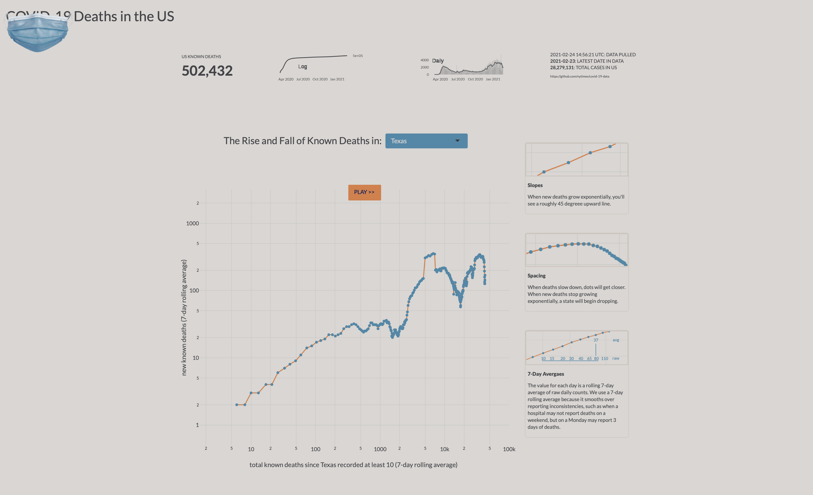

```{r setup, include=FALSE}
knitr::opts_chunk$set(echo = FALSE)
```

```{r image, echo=FALSE, fig.cap="Top distinguishing words in men's and women's Christian-Living book descriptions", message=FALSE, warning=FALSE, layout="l-screen-inset", paged.print=FALSE}



```

I made this R Shiny app for my family to track a single metric. To promote data literacy, I included explanatory text with the data visualizations. CSS flexbox controls the layout, so the app works on mobile devices well.

The main visualization is an animated chart I created with [the plotly package for R](https://plotly.com/r/). Plotly for R enables interactive javascript-based visuals. I chose this for the main data visual in order to make obvious when the coronavirus is spreading exponentially and when it is not.

The image above is just a screenshot. [Go check out the app at https://jeremyallen.shinyapps.io/covid_deaths/](https://jeremyallen.shinyapps.io/covid_deaths/).
