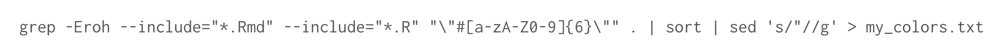

```{r setup, include=FALSE}
knitr::opts_chunk$set(echo = FALSE)
```

## Problem: how do I identify specific elements used in all of my .R and .Rmd files, for example, how do I count all the hex codes I've ever used?

During a recent dataviz challenge, [Ijeamaka Anyene manually counted](https://twitter.com/ijeamaka_a/status/1379493271806771203?s=20) all the hex codes in her R scripts. She wondered how to do it automatically. I'm no Bash expert, but I knew the gist of a solution, so I googled around a few places and was able to piece together a Bash command using `grep` and `sed`.

## The solution

```{r image, echo=FALSE, fig.width=8, message=FALSE, warning=FALSE, layout="l-body-outset", paged.print=FALSE}

```

This is a series of three commands, using grep, sort, and sed, that you run in a Mac or Linux terminal. That terminal is most likely using a Bash or Zsh shell. `grep`, `sort`, and `sed` are three utility "apps" that work in Bash and Zsh.

### grep

[grep is a search utility](https://linuxcommand.org/lc3_man_pages/grep1.html), and here we tell grep to search my directory to find a pattern. The pattern is `\"#[a-zA-Z0-9]{6}\"`. That will locate all instances of hex codes like "#FFFFFF". The `--include` parameters limit the search to .R and .Rmd files. The `-Eroh` flags tell grep to (`r`) recursively search all sub-folders in my directory, enable (`E`) extended regex capability so we can use the `{6}` modifier in our pattern, (`h`) hide filenames in the results because we only want the hex codes, and show (`o`) only the match in the results instead of the default which is to show the whole line where are a match occurs. The `.` that appears after the pattern is the file path where we want `grep` to search. The `.` stands for the current dirctory, so make sure that your terminal is set to the directory where all of your scripts live, or you can type another file path there.

### |

The vertical pipe lets us pass the results of the `grep` search on to another utility, in this case, the `sort` utility because I want the `grep` search results sorted, but this is not necessary. Then we use the `|` again to pass the results to [the `sed` utility](https://www.gnu.org/software/sed/manual/sed.html) so we can remove the quotation marks that were captured with each hexcode.  

### sort and sed

The `sed` command is `s/"//g`. The `s` means we want to make a substitution. We want to substitute all quotation marks with nothing, i.e., delete all quotation marks. Between the first two slashes we provide the pattern for `sed` to find, in our case, a quotation mark. Between the second and third slash we provide the replacement, in our case, nothing, so there is nothing between the second and third slash. After the third slash we tell `sed` where to perform the substitution, in our case that is throughout all the search results, so we use `g`, which I think means global.  

### write to file  

Finally, we want our results written into a text document, so we use `>` instead of `|` to write our results into a new file called `my_colors.txt`.  

Then we can import that file into R suing `read_lines()` and count our use of each hexcode.

### Don't forget

The whole command is:  
`grep -Eroh --include="*.Rmd" --include="*.R" "\"#[a-zA-Z0-9]{6}\"" . | sort | sed 's/"//g' > my_colors.txt`

Check out the nice dataviz [Ijeamaka Anyene](https://twitter.com/ijeamaka_a/status/1379493271806771203?s=20) made!


